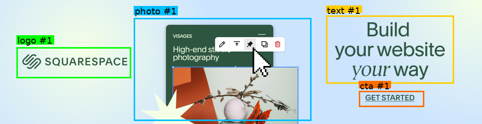

### Macro Placement (AI Image Editing – Layout Planner)

This project is a focused module of a broader AI image editing pipeline. It performs macro placement: given an image and its segmented objects, it recomposes those objects on a newly generated canvas of a different aspect ratio. The system decides which object goes roughly where and in what order (containers/rows/columns), not the pixel-precise “micro” adjustments. It assumes object segmentation is already done, and that micro placement or fine alignment happens in a downstream step.

The core idea is to combine a deterministic compositor with a VLM-guided layout plan expressed in a simple Flex-DSL (row/column containers with justify/align/padding/gap). A Streamlit app wraps the pipeline so you can experiment with persona prompts and see iteration-by-iteration results.

## Why this matters

- **Creative adaptation at scale**: Re-layout a single visual concept across formats (e.g., 9:16 → 1:1 → 16:9) while keeping brand intent.
- **Separation of concerns**: Macro placement handles grouping/order/rough location; later stages can handle typography, constraints, pixel-accurate nudges, and effects.
- **Prompt engineering surface**: Different “personas” (Initial layout, Critic, Refiner) let you explore instruction styles and context blocks that consistently yield better layouts for your brand or content type.

## What it does (high level)

1) Reads a pre-segmented bundle for an input image: `background.png`, `results.json`, and `objects/` (cutouts).

2) Computes a target canvas size for a chosen aspect ratio while preserving pixel budget, then synthesizes a solid background color based on the original.

3) Builds a labeled contact sheet and a shared context (object roles, normalized boxes, non‑nestable pairs by axis, best‑practice notes by aspect family).

4) VLM stage via Nebius (e.g., Qwen2.5-VL):
- Initial layout persona produces a Flex‑DSL JSON (one container tree) that covers every object exactly once.
- Critic persona reviews the composed draft and flags issues and hard‑rule violations.
- Refiner persona writes a new JSON addressing the critique (optionally with validator feedback when needed).

5) Deterministic compositor renders the placements. The process can iterate a few times (critique → refine → compose) to improve the layout.

### Visual overview

<p align="center" style="text-align:center;">
  <span style="display:inline-block; text-align:center; vertical-align:middle;">
    <br/>
    <sub>Original</sub>
  </span>
  <span style="font-size:28px; margin: 0 16px; vertical-align:middle;">→</span>
  <span style="display:inline-block; text-align:center; vertical-align:middle;">
    <br/>
    <sub>Segmentation (outside this module)</sub>
  </span>
</p>

<p align="center" style="text-align:center;">
  <span style="display:inline-block; text-align:center; vertical-align:middle;">
    <br/>
    <sub>Iter 0</sub>
  </span>
  <span style="font-size:28px; margin: 0 16px; vertical-align:middle;">→</span>
  <span style="display:inline-block; text-align:center; vertical-align:middle;">
    <br/>
    <sub>Iter 1</sub>
  </span>
  <span style="font-size:28px; margin: 0 16px; vertical-align:middle;">→</span>
  <span style="display:inline-block; text-align:center; vertical-align:middle;">
    <em>additional iterations…</em>
  </span>
</p>

## Prompt engineering playground

The Streamlit UI exposes full prompt boxes for each persona:
- **Initial layout prompt**: responsible for producing a valid first‑draft Flex‑DSL JSON.
- **Critic prompt**: scores, flags constraint violations, and provides actionable feedback.
- **Refiner prompt**: rewrites the JSON to address the critique.

You can adjust each prompt fully, run the pipeline, compare iterations, and iterate your instructions. This helps discover persona wording and context structures that are robust for your content.

## Typical applications

- **Ad creative resizing/adaptation** (vertical, square, horizontal, ultra‑wide)
- **Social placements** (story, reel, post, banner) from a single master creative
- **Localization & variant generation** (same macro structure, different copy/assets)
- **A/B experimentation** on layout structure before micro‑polish stages

## Assumptions and limits

- Input is already segmented; this module does not perform segmentation.
- Outputs are “macro” placements; downstream tools should handle fine alignment, typography, and style.
- The Flex‑DSL is intentionally small (depth ≤ 2) to keep the search space tractable and the output deterministic.

## Running the app (local, with uv)

Prereqs: Python and `uv` installed.

```bash
uv run --with streamlit --with pillow --with numpy --with openai \
  streamlit run app.py
```

In the UI:
- Paste your Nebius API key in the sidebar (used only for this session).
- Pick an input image from `input/`.
- Ensure the segmentation bundle exists at `output/<image_stem>/` with `background.png`, `results.json`, and `objects/`.
- Set ratio, align, margin, temperature, and refine iterations.
- Optionally edit the full persona prompts. Run the pipeline and explore iterations.

## Inputs and outputs (expected layout)

- `input/<name>.png|jpg` – original input image (displayed in the UI)
- `output/<name>/` – segmentation bundle (required)
  - `background.png` – original background with holes/alpha
  - `results.json` – list of objects: `{object_id, filename, label, bounding_box}`
  - `objects/` – cutouts referenced by `results.json`
- `output_macro_placement/<name>/iteration_XX/`
  - `final_product/draft_macro_iter_XX.png` – composed result
  - `vlm_input_text/*` – prompts and validator outputs
  - `vlm_output/*` – raw VLM responses and layout JSONs
  - `layout_json/layout_macro_iter_XX.json` – final placements used by compositor
  - `time_log.txt` – step timings

## Code structure (brief)

- `macro_placement_test.py` – pipeline entry (`run_macro_only`), prompt building, VLM calls, validation, iteration orchestration
- `api_client.py` – unified Nebius/Ollama client (Nebius via OpenAI SDK base_url), session‑scoped API key support
- `layout_constraints.py` – canvas sizing, grid helpers, flow layout utilities
- `background_resizing.py` – background synthesis (solid median color)
- `compositor.py` – deterministic alpha compositing given placements
- `app.py` – Streamlit UI (parameters, prompt editing, iteration viewer)
- `utils/` – small helpers (timing, labels)

## Roadmap

- Micro placement stage (pixel‑level nudges, overlaps, typography)
- Constraint solver integration for stricter guarantees
- Multi‑run comparison and presets for persona prompts
- Optional gradient/texture background synthesis

## Notes on privacy

The Nebius API key is collected in the Streamlit sidebar and used only in the current session. It is not logged or written to disk.


